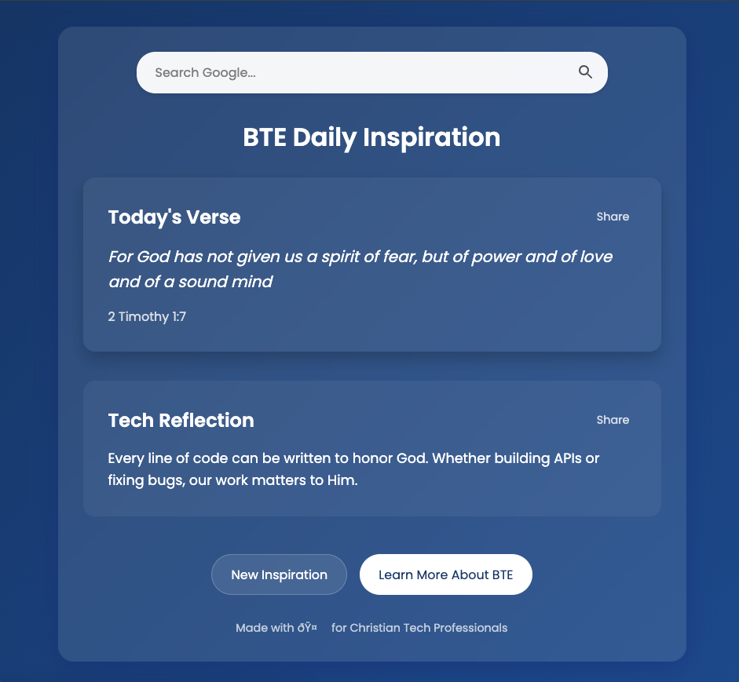

# BTE Daily Inspiration Chrome Extension

A Chrome extension that transforms your new tab into a daily source of spiritual inspiration for Christian tech professionals, featuring tech-related Bible verses and reflections.

## Features

- 🔍 **Google Search Integration**: Seamlessly search the web without leaving your new tab
- 📖 **Daily Bible Verses**: Curated selection of tech-related Bible verses
- 💡 **Tech Reflections**: Thoughtful devotionals connecting faith and technology
- 🔄 **Category Matching**: Smart pairing of verses and reflections by theme
- 🌟 **Modern UI**: Clean, responsive design with smooth animations
- 📱 **Share Functionality**: Easily share verses and reflections
- ⌨️ **Keyboard Shortcuts**: Quick access with keyboard commands

## Installation

1. Download or clone this repository
2. Open Chrome and navigate to `chrome://extensions/`
3. Enable "Developer mode" in the top right corner
4. Click "Load unpacked" and select the extension directory
5. The extension will now replace your new tab page

## Usage

### Keyboard Shortcuts
- Press `/` to focus the search bar
- Press `Esc` to clear and exit search
- Press `Enter` to perform a Google search

### Features
- **Search**: Use the Google search bar at the top just like your regular new tab
- **Daily Inspiration**: New verse and reflection appear each day
- **Manual Refresh**: Click "New Inspiration" for fresh content
- **Share**: Use the share buttons to share verses or reflections
- **Learn More**: Connect with BTE through the "Learn More" button

## Categories

The extension includes verses and reflections in various categories:
- Excellence
- Skill
- Courage
- Wisdom
- Purpose
- Guidance
- Service
- Creativity

## Technical Details

### Built With
- HTML5
- CSS3 (with modern features like backdrop-filter)
- Vanilla JavaScript
- Chrome Extension APIs

### Storage
- Uses Chrome's local storage for persistence
- Content refreshes every 24 hours
- Maintains state between browser sessions

## Contributing

We welcome contributions! Please feel free to:
1. Fork the repository
2. Create a feature branch
3. Submit a pull request

## License

This project is licensed under the MIT License - see the LICENSE file for details.

## Credits

Created by the BTE Software Development Team for Christian Tech Professionals.

## Contact

For more information about Believers Tech Expo:
- Website: [believerstechexpo.com](https://believerstechexpo.com)
- Email: [contact@believerstechexpo.com](mailto:contact@believerstechexpo.com)

---

Made with ❤️ by BTE Software Development Team 